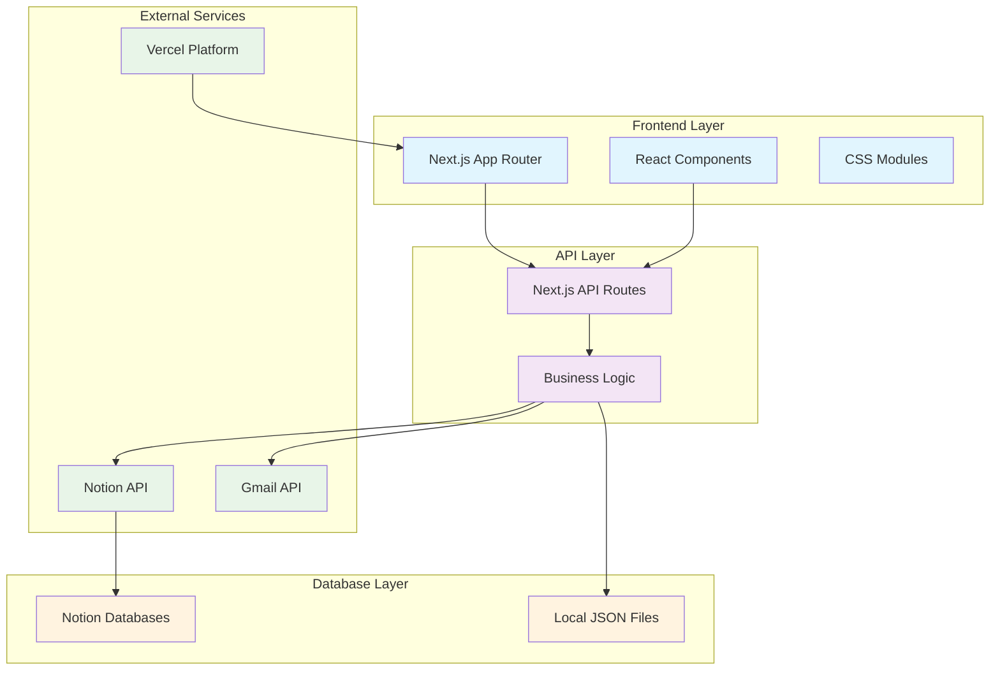
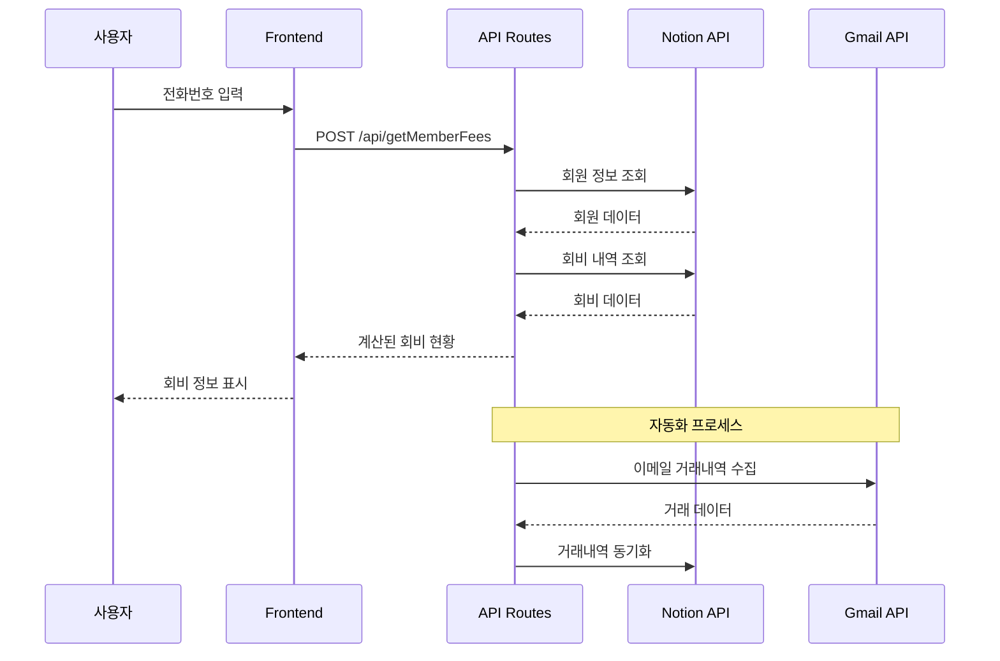
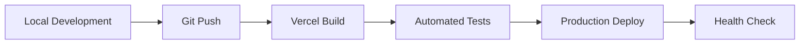

# 영양 로타리클럽 회비 관리 시스템

## 📊 프로젝트 개요

영양 로타리클럽 회원들의 회비를 효율적으로 관리하기 위한 Next.js 기반 웹 애플리케이션입니다. 회원들은 전화번호 뒷 4자리로 자신의 회비 현황을 조회할 수 있으며, 관리자는 회비 데이터를 관리할 수 있습니다.

## 🎯 비즈니스 요구사항

### 핵심 목표
- 영양 로타리클럽 회원들의 회비 관리 효율화
- 투명한 회비 현황 공유
- 관리자의 업무 부담 경감
- 자동화를 통한 정확성 향상

### 사용자 스토리

#### 회원 (일반 사용자)
```
As a 로타리클럽 회원
I want to 내 회비 현황을 쉽게 조회하고 싶다
So that 납부 상황을 정확히 파악할 수 있다
```

#### 관리자 (재무담당자)
```
As a 재무담당자
I want to 회비를 효율적으로 관리하고 싶다
So that 정확한 회계 처리가 가능하다
```

## 🌐 배포 정보

- **운영 URL**: https://yyrotary.vercel.app/
- **플랫폼**: Vercel
- **프레임워크**: Next.js 15.2.4

## 🏗 시스템 아키텍처

### High-Level Architecture


### Data Flow Diagram


## 📁 프로젝트 구조 및 파일 설명

```
feemanagement/
├── app/                          # Next.js App Router (메인 애플리케이션)
│   ├── api/                      # API 라우트 (서버 사이드 엔드포인트)
│   │   ├── addDonation/         # 기부금 추가 API
│   │   ├── addFee/              # 일반 회비 추가 API
│   │   ├── addServiceFee/       # 봉사금 추가 API
│   │   ├── addSpecialFee/       # 특별회비 추가 API
│   │   ├── calculateSpecialFee/ # 특별회비 계산 로직
│   │   ├── cron/                # 자동화 크론 작업 (이메일 동기화)
│   │   ├── deleteDonation/      # 기부금 삭제 API
│   │   ├── deleteFee/           # 회비 삭제 API
│   │   ├── deleteServiceFee/    # 봉사금 삭제 API
│   │   ├── deleteSpecialFee/    # 특별회비 삭제 API
│   │   ├── getAllMasterInfo/    # 마스터 정보 조회 API
│   │   ├── getDonations/        # 기부금 목록 조회
│   │   ├── getFees/             # 회비 목록 조회
│   │   ├── getFriendDonations/  # 친선회 기부금 조회
│   │   ├── getMasterInfo/       # 마스터 정보 개별 조회
│   │   ├── getMemberFees/       # 회원별 회비 현황 조회 (핵심 API)
│   │   ├── getMembers/          # 회원 목록 조회
│   │   ├── getNotices/          # 공지사항 조회
│   │   ├── getServiceFees/      # 봉사금 목록 조회
│   │   ├── getSpecialEvents/    # 특별 이벤트 목록 조회
│   │   ├── getSpecialFees/      # 특별회비 목록 조회
│   │   ├── getSpecialFeesByDate/ # 날짜별 특별회비 조회
│   │   ├── getTopContributors/  # 최고 기여자 조회
│   │   ├── getTransactions/     # 거래내역 조회
│   │   ├── oauth/               # OAuth 인증 처리
│   │   ├── syncTransactions/    # 거래내역 동기화
│   │   ├── updateMasterInfo/    # 마스터 정보 업데이트
│   │   ├── updateTransactions/  # 거래내역 업데이트
│   │   ├── uploadTransactions/  # 거래내역 CSV 업로드
│   │   └── verifyAdmin/         # 관리자 인증 확인
│   ├── admin/                   # 관리자 페이지 그룹
│   │   ├── dashboard/           # 관리자 대시보드 (통계 및 요약)
│   │   ├── donation/            # 기부금 관리 페이지
│   │   ├── fee/                 # 회비 관리 페이지
│   │   ├── servicefee/          # 봉사금 관리 페이지
│   │   ├── settings/            # 시스템 설정 페이지
│   │   ├── transactions/        # 거래내역 관리 페이지
│   │   ├── admin.module.css     # 관리자 페이지 공통 스타일
│   │   └── page.tsx             # 관리자 메인 페이지 (로그인)
│   ├── components/              # 재사용 가능한 React 컴포넌트
│   │   ├── CSVUploader.tsx      # CSV 파일 업로드 컴포넌트
│   │   ├── DonationSection.tsx  # 기부금 섹션 컴포넌트
│   │   ├── FileUploader.tsx     # 범용 파일 업로더
│   │   ├── InfoSection.tsx      # 회원 정보 표시 컴포넌트
│   │   ├── ServiceFeeSection.tsx # 봉사금 섹션 컴포넌트
│   │   ├── SpecialFeeSection.tsx # 특별회비 섹션 컴포넌트
│   │   └── *.module.css         # 각 컴포넌트별 CSS 모듈
│   ├── types/                   # TypeScript 타입 정의
│   │   ├── donation.ts          # 기부금 관련 타입
│   │   ├── specialFee.ts        # 특별회비 관련 타입
│   │   └── transaction.ts       # 거래내역 관련 타입
│   ├── favicon.ico              # 웹사이트 파비콘
│   ├── globals.css              # 전역 CSS 스타일
│   ├── layout.tsx               # 루트 레이아웃 (HTML 구조)
│   ├── page.module.css          # 메인 페이지 스타일
│   └── page.tsx                 # 메인 페이지 (회비 조회 화면)
├── lib/                         # 유틸리티 및 설정 라이브러리
│   ├── notion.ts               # Notion API 클라이언트 설정
│   └── notion-types.ts         # Notion 응답 타입 정의
├── public/                     # 정적 파일 저장소
│   ├── rotary-logo.png         # 로타리클럽 공식 로고
│   └── *.svg                   # 기타 아이콘 파일들
├── debug/                      # 디버깅 파일 저장소
│   └── parsed_mail_*.html      # 파싱된 이메일 HTML 파일들
├── temp/                       # 임시 파일 저장소
│   └── after_auth_screenshot_*.png # 인증 후 스크린샷들
├── fee_db.json                 # 회비 데이터 로컬 백업
├── member_db.json              # 회원 데이터 로컬 백업
├── gmailapiclient.json         # Gmail API 클라이언트 설정
├── CRON-SETUP.md               # 크론 작업 설정 가이드
├── WORK_LOG.md                 # 작업 로그 및 분석
├── package.json                # Node.js 의존성 및 스크립트
├── next.config.ts              # Next.js 설정 파일
├── tsconfig.json               # TypeScript 설정
├── eslint.config.mjs           # ESLint 코드 품질 설정
├── vercel.json                 # Vercel 배포 설정
└── types.d.ts                  # 전역 TypeScript 타입 선언
```

## 🛠 기술 스택

### Frontend
- **Next.js** 15.2.4 (React 19.0.0) - 풀스택 React 프레임워크
- **TypeScript** 5.x - 정적 타입 시스템
- **CSS Modules** - 컴포넌트 기반 스타일링
- **React-Toastify** 11.0.5 - 사용자 알림 시스템

### Backend & APIs
- **Next.js API Routes** - 서버리스 백엔드 API
- **Notion API** (@notionhq/client 2.3.0) - 데이터베이스 연동
- **Google APIs** (googleapis 105.0.0) - Gmail 통합
- **NextAuth.js** 4.24.11 - 인증 시스템

### 데이터 처리
- **PapaParse** 5.5.2 - CSV 파일 파싱
- **XLSX** 0.18.5 - Excel 파일 처리
- **Date-fns** 4.1.0 - 날짜 처리 유틸리티

### 외부 서비스 및 도구
- **Cheerio** 1.0.0 - HTML 파싱 (이메일 처리)
- **Puppeteer** 24.6.0 - 웹 스크래핑 및 자동화
- **Nodemailer** 6.10.0 - 이메일 송신

## 🎯 주요 기능

### 회원 기능
1. **회비 조회**: 전화번호 뒷 4자리로 개인 회비 현황 확인
2. **다중 회비 유형 지원**:
   - 연회비 (일반: 720,000원, 시니어: 200,000원)
   - 특별회비 (경조사별 20,000원)
   - 봉사금
   - 기부금
3. **납부 내역 상세 조회**: 날짜, 금액, 납부 방법별 내역

### 관리자 기능
1. **회비 관리**: 추가, 수정, 삭제
2. **회원 관리**: 회원 정보 조회 및 관리
3. **거래내역 관리**: CSV 업로드, 자동 동기화
4. **대시보드**: 전체 회비 현황 및 통계
5. **자동화**: 크론 작업을 통한 Gmail 거래내역 동기화

## 📊 데이터 모델

### 회원 (Members)
```typescript
interface Member {
  id: string;           // Notion Page ID
  name: string;         // 회원 이름
  nickname?: string;    // 별명
  phone: number;        // 전화번호 뒷 4자리
  deduction: string[];  // 할인 유형 (senior 등)
}
```

### 회비 (Fees)
```typescript
interface Fee {
  id: string;           // Notion Page ID
  member: string;       // Member ID (Relation)
  date: string;         // 납부 날짜
  paid_fee: number;     // 납부 금액
  method: string[];     // 납부 방법 (cash, card, deposit)
}
```

### 특별회비 (Special Fees)
```typescript
interface SpecialFee {
  id: string;           // Notion Page ID
  member: string;       // Member ID (Relation)
  date: string;         // 납부 날짜
  amount: number;       // 납부 금액
  method: string[];     // 납부 방법
}
```

### 특별 이벤트 (Special Events)
```typescript
interface SpecialEvent {
  id: string;           // Notion Page ID
  date: string;         // 이벤트 날짜
  name: string;         // 대상자 이름
  nickname?: string;    // 대상자 별명
  events: string;       // 이벤트 유형 (결혼, 장례 등)
}
```

## 🔗 데이터베이스 구조 (Notion)

### 주요 데이터베이스
- **MEMBERS**: 회원 정보 (1c47c9ec-930b-8057-bbd9-f8b6708a0294)
- **FEES**: 일반 회비 (1c47c9ec-930b-8018-a42b-d84fd02124df)
- **SPECIAL_EVENTS**: 특별회비 이벤트 (1c47c9ec930b80f8a459f14ff17b32b6)
- **SPECIAL_FEES**: 특별회비 납부 (1c47c9ec930b800e85ebc172be283abe)
- **SERVICE_FEES**: 봉사금 (1c47c9ec930b805fa2afe3716f9d7544)
- **DONATIONS**: 기부금 (1c47c9ec930b80d88b18c578d7cc9f4a)
- **TRANSACTIONS**: 거래내역 (1cf7c9ec930b802584eaf3b2628a864d)
- **MASTER_INFO**: 마스터 정보 (1c57c9ec930b803785d5d88539c20a21)

## 🔧 API 명세서

### 1. 회원 회비 조회 (핵심 API)
```http
POST /api/getMemberFees
Content-Type: application/json

{
  "phone": "1234"
}
```

**Response:**
```json
{
  "id": "notion-page-id",
  "name": "홍길동",
  "nickname": "길동이",
  "totalPaid": 720000,
  "remainingFee": 0,
  "feeHistory": [
    {
      "date": "2024-01-15",
      "paid_fee": 360000,
      "method": ["deposit"]
    }
  ]
}
```

### 2. 특별회비 계산
```http
GET /api/calculateSpecialFee?memberName=홍길동
```

### 3. 관리자 인증
```http
POST /api/verifyAdmin
Content-Type: application/json

{
  "password": "admin-password"
}
```

### 4. 회비 추가
```http
POST /api/addFee
Content-Type: application/json

{
  "memberId": "notion-page-id",
  "amount": 360000,
  "date": "2024-01-15",
  "method": ["deposit"]
}
```

## 🎨 UI/UX 설계

### Design System

#### Color Palette
```css
:root {
  --primary-blue: #1f4788;      /* 로타리 블루 */
  --accent-gold: #f7931e;       /* 로타리 골드 */
  --success-green: #28a745;     /* 성공 */
  --warning-orange: #ffc107;    /* 경고 */
  --error-red: #dc3545;         /* 오류 */
  --text-dark: #333333;         /* 기본 텍스트 */
  --text-light: #666666;        /* 보조 텍스트 */
  --background: #ffffff;        /* 배경 */
  --border: #e9ecef;           /* 테두리 */
}
```

#### Typography
```css
.title {
  font-size: 2.5rem;
  font-weight: 700;
  color: var(--primary-blue);
}

.subtitle {
  font-size: 1.5rem;
  font-weight: 600;
  color: var(--text-dark);
}

.body {
  font-size: 1rem;
  font-weight: 400;
  color: var(--text-dark);
}

.caption {
  font-size: 0.875rem;
  font-weight: 400;
  color: var(--text-light);
}
```

## 🔒 보안 설계

### Authentication
- **관리자 인증**: 비밀번호 기반 (향후 JWT 토큰으로 개선 예정)
- **세션 관리**: NextAuth.js 활용 (구현 준비 중)

### Authorization
- **공개 접근**: 회비 조회 기능
- **관리자 전용**: 회비 관리, 대시보드, 설정

### Data Protection
- **입력 검증**: 클라이언트/서버 양측 검증
- **API 보안**: Notion API 키 환경변수 관리
- **XSS 방지**: React의 기본 XSS 보호 활용

### API Security
```typescript
// API 라우트 보호 패턴
export async function POST(request: Request) {
  try {
    // 1. 입력 검증
    const { phone } = await request.json();
    if (!phone || phone.length !== 4) {
      return NextResponse.json({ error: '올바른 전화번호를 입력하세요.' }, { status: 400 });
    }

    // 2. 비즈니스 로직
    // ...

    // 3. 안전한 응답
    return NextResponse.json(data);
  } catch (error) {
    // 4. 에러 처리 (민감 정보 노출 방지)
    return NextResponse.json({ error: '서버 오류가 발생했습니다.' }, { status: 500 });
  }
}
```

## 🔧 환경 설정

### 필수 환경 변수
```bash
# Notion API
NOTION_API_KEY=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

# 데이터베이스 ID들은 lib/notion.ts에서 직접 관리
```

### 설치 및 실행
```bash
# 의존성 설치
npm install

# 개발 서버 실행
npm run dev

# 빌드
npm run build

# 프로덕션 실행
npm start

# 린팅
npm run lint
```

## 📱 사용자 인터페이스

### 메인 페이지 (/):
- 영양로타리클럽 로고
- 전화번호 뒷 4자리 입력 폼
- 회비 조회 기능

### 관리자 페이지 (/admin):
- 비밀번호 인증
- 대시보드 접근

### 회비 조회 결과:
- 회원 정보 표시
- 탭별 회비 유형 (연회비/특별회비/봉사금/기부)
- 납부 총액 및 미납 총액
- 상세 납부 내역 테이블

## 🚀 배포 및 DevOps

### Deployment Pipeline


### Environment Configuration
```bash
# Development
NODE_ENV=development
NOTION_API_KEY=your-dev-key

# Production
NODE_ENV=production
NOTION_API_KEY=your-prod-key
```

### Monitoring
- **에러 추적**: Console.error 로깅
- **성능 모니터링**: Vercel Analytics
- **사용자 분석**: 기본 접속 로그

## 📊 외부 연동

### Notion API
- 모든 데이터는 Notion 데이터베이스에 저장
- 실시간 데이터 동기화
- 관계형 데이터 구조 활용

### Gmail API
- 거래내역 자동 수집
- 이메일 파싱 및 데이터 추출
- OAuth 2.0 인증 방식

## 🔄 자동화 기능

### 크론 작업 (/api/cron)
- 정기적인 데이터 동기화
- 이메일 거래내역 자동 수집
- 시뮬레이션 기능 제공

## 💾 데이터 관리

### CSV 업로드
- 거래내역 대량 업로드
- 회비 데이터 일괄 처리
- 파일 검증 및 오류 처리

### 파일 관리
- Debug 폴더: 파싱된 메일 HTML 저장
- Temp 폴더: 스크린샷 및 임시 파일
- JSON 파일: 로컬 데이터베이스 백업

## 🐛 디버깅 및 로깅

- 상세한 콘솔 로그
- 에러 추적 및 처리
- HTML 파싱 결과 저장

## 🎨 디자인 특징

- 로타리클럽 공식 색상 사용
- 반응형 웹 디자인
- 모던한 CSS Modules 스타일링
- 직관적인 사용자 인터페이스

## 📞 특별 사용자 지원

- **권민혁 회원**: 휴대번호 앞 4자리로 조회 (특별 안내 메시지 표시)

## 🔧 개발자 정보

### 코드 품질
- TypeScript 강타입 시스템
- ESLint 코드 스타일 관리
- 컴포넌트 기반 아키텍처

### API 설계
- RESTful API 구조
- 적절한 HTTP 상태 코드
- JSON 응답 형식

## 📈 성능 최적화

### Frontend Optimization
```typescript
// 1. 코드 분할
const AdminDashboard = dynamic(() => import('./components/AdminDashboard'), {
  loading: () => <p>Loading...</p>,
});

// 2. 이미지 최적화
import Image from 'next/image';
<Image 
  src="/rotary-logo.png"
  alt="로고"
  width={400}
  height={400}
  priority
/>

// 3. 메모이제이션
const MemberList = memo(({ members }) => {
  // 컴포넌트 로직
});
```

### Backend Optimization
```typescript
// 1. API 응답 캐싱
export async function GET(request: Request) {
  const data = await getCachedData();
  return NextResponse.json(data, {
    headers: {
      'Cache-Control': 'public, s-maxage=60'
    }
  });
}

// 2. 데이터베이스 쿼리 최적화
const memberResponse = await notionClient.databases.query({
  database_id: DATABASE_IDS.MEMBERS,
  filter: {
    property: 'phone',
    number: { equals: Number(phone) }
  },
  page_size: 1 // 필요한 만큼만 조회
});
```

## 🧪 테스트 전략

### Testing Pyramid
```
                /\
               /  \
              / E2E \
             /______\
            /        \
           /Integration\
          /____________\
         /              \
        /   Unit Tests   \
       /________________\
```

### Unit Tests (계획)
```typescript
// 예시: 전화번호 검증 테스트
describe('Phone validation', () => {
  test('should accept 4-digit phone number', () => {
    expect(validatePhone('1234')).toBe(true);
  });

  test('should reject non-4-digit phone number', () => {
    expect(validatePhone('123')).toBe(false);
    expect(validatePhone('12345')).toBe(false);
  });
});
```

### Integration Tests (계획)
```typescript
// 예시: API 테스트
describe('/api/getMemberFees', () => {
  test('should return member data for valid phone', async () => {
    const response = await fetch('/api/getMemberFees', {
      method: 'POST',
      body: JSON.stringify({ phone: '1234' })
    });
    
    expect(response.status).toBe(200);
    const data = await response.json();
    expect(data).toHaveProperty('name');
  });
});
```

## 📝 향후 개발 계획

1. 더 상세한 통계 대시보드
2. 모바일 앱 개발
3. 자동 알림 기능
4. 결제 시스템 통합
5. 회원 포털 확장
6. 단위 테스트 및 통합 테스트 구현
7. CI/CD 파이프라인 구축

## 📚 참고 문서

### External APIs
- [Notion API Documentation](https://developers.notion.com/)
- [Gmail API Documentation](https://developers.google.com/gmail/api)
- [Next.js Documentation](https://nextjs.org/docs)

### Internal Documentation
- `WORK_LOG.md`: 작업 기록 및 분석
- `CRON-SETUP.md`: 자동화 설정 (수정 필요)

### Code Documentation
```typescript
/**
 * 회원의 회비 정보를 조회합니다.
 * @param phone - 전화번호 뒷 4자리
 * @returns Promise<MemberData> - 회원 정보 및 회비 현황
 * @throws {Error} 회원을 찾을 수 없는 경우
 */
export async function getMemberFees(phone: string): Promise<MemberData> {
  // 구현 로직
}
```

---

**문서 버전**: v2.0  
**최종 업데이트**: 2025년 7월 3일  
**담당자**: Development Team  
**검토자**: Project Manager  

**Note**: 이 시스템은 영양 로타리클럽의 회비 관리 효율성을 높이기 위해 개발되었으며, 지속적인 업데이트와 개선이 이루어지고 있습니다.
